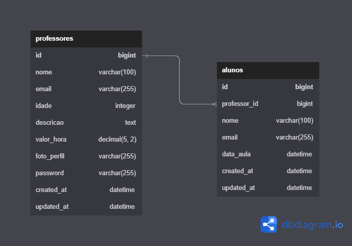

# Desafio: HyperProf

  API para gerenciamento de professores e aulas particulares

## índice

- [Descrição](#descrição)
- [Rotas](#rotas)
- [Requisitos](#requisitos)
- [Casos de Uso](#casos-de-uso)

## Descrição

Seu desafio é criar uma API para gerenciar professores e aulas particulares. A API deve permitir que professores se cadastrem e sejam listados, além de permitir que alunos busquem professores por descrição.

## Rotas

| Rota                                       | Método | Descrição                                         | Requer Autenticação | Recursos fora do curso |
| ------------------------------------------ | ------ | ------------------------------------------------- | ------------------- |------------------------|
| /api/professores  #                        | GET    | Lista os professores                              | Não                 |                        |
| /api/professores  #                        | POST   | Cadastra um professor                             | Não                 |                        |
| /api/professores  #                        | PUT    | Atualiza os dados do professor logado             | Sim                 |                        |
| /api/professores  #                        | DELETE | Exclui o professor logado                         | Sim                 |                        |
| /api/professores/{professor_id}  #         | GET    | Detalhes do professor                             | Não                 |                        |
| /api/professores/foto   #                  | POST   | Atualiza a foto de um professor                   | Sim                 |                        |
| /api/professores/me    #                   | GET    | Lista o professor logado                          | Sim                 | # Url modificada       |
| /api/professores/{materia_id}/materias #   | GET    | Procura professor por Matéria(assunto)            | Não                 | # Adicinado            |
| /api/professores/aulas #                   | GET    | Lista as aulas e requisições de aula de um prof.  | Sim                 | # Adicinado            |
| /api/professores/aulas/{aula_id} #         | GET    | Detalhes de uma aula                              | Sim                 | # Adicionado           |
| /api/professores/aulas/aceitar/{aula_id} # | POST   | Aceita uma aula                                   | Sim                 | # Adicionado           |
| /api/professores/aulas/cancelar/{aula_id} #| POST   | Cancela uma aula                                  | Sim                 | # Adicionado           |
| ------------------------------------------ |--------|---------------------------------------------------|---------------------|------------------------|
| /api/alunos   #                            | POST   | Cadastra um estudante                             | Não                 | # Adicionado           |
| /api/alunos   #                            | PUT    | Atuaiza os dados de um estudante logado           | Sim                 | # Adicionado           |
| /api/alunos   #                            | DELETE | Deleta um aluno logado                            | Sim                 | # Adicionado           |
| /api/alunos/me #                           | GET    | Lista o aluno logado                              | Sim                 | # Adicionado           |
| /api/alunos/foto #                         | POST   | Atualiza a foto de um professor                   | Sim                 | # Adicionado           |
| /api/alunos/agendar-aulas #                | POST   | Cria uma requisição de aula                       | Sim                 | # Adicionado           |
| /api/alunos/atualizar-aula/{aula_id}  #    | PUT    | Atualiza dados de uma aula                        | Sim                 | # Adicionado           |
| /api/alunos/aulas                          | GET    | Lista as aulas de um aluno                        | Sim                 | # Adicionado           |
| /api/alunos/aulas/{aula id}                | GET    | Detalhes da aula                                  | Sim                 | # Adicionado           |
| ---------------------------------------    |--------|---------------------------------------------------|---------------------|------------------------|
| /api/materias                              | GET    | Lista de todas as materias(subjects)              | Não                 | # Adicionado           |
| /api/materias                              | POST   | Cria uma nova materia(subject)                    | Sim(superuser)      | # Adicionado           |
| /api/materias                              | DELETE | Deleta uma materia(subject)                       | Sim(superuser)      | # Adicionado           |
| /api/materias                              | PUT    | Atualiza completamente uma materia(subject)       | Sim(superuser)      | # Adicionado           |
|----------------------------------------    |--------|---------------------------------------------------|---------------------|------------------------|
| /api/auth/login                            | POST   | Faz login                                         | Não                 |                        |
| /api/auth/refresh                          | POST   | Atualiza o token de acesso                        | Não                 |                        |
| /api/auth/logout                           | POST   | Faz logout                                        | Sim                 |                        |

## Diagrama Banco de Dados

A aplicação terá duas tabelas que irão se relacionar entre si, sendo elas a tabela `professores` e a tabela `alunos`.

## Requisitos

- [Funcionais](requisitos/funcionais.md)
- [Não Funcionais](requisitos/nao-funcionais.md)

## Casos de Uso

- [PR01 - Cadastro de professor](casos-de-uso/PR01.md)
- [PR02 - Login](casos-de-uso/PR02.md)
- [PR03 - Atualização de dados pessoais](casos-de-uso/PR03.md)
- [PR04 - Listagem de Alunos](casos-de-uso/PR04.md)
- [PR05 - Exclusão de professor](casos-de-uso/PR05.md)
- [AL01 - Busca de professores](casos-de-uso/AL01.md)
- [AL02 - Detalhes do professor](casos-de-uso/AL02.md)
- [AL03 - Cadastro de Aula](casos-de-uso/AL03.md)
